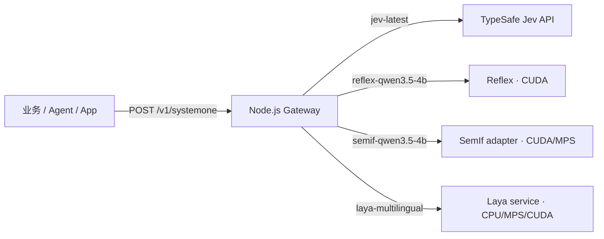

<div align="center">

# Decision Infra

**一份 Jev-compatible `/v1/systemone` contract，切换托管 Jev 与三个本地决策模型。**

[](https://www.typescriptlang.org/)
[](https://nodejs.org/)
[](https://www.python.org/)
[](https://fastify.dev/)
[](https://pytorch.org/)
[](https://docs.docker.com/compose/)

[快速开始](#两分钟接入-jev) · [运行环境](#运行环境) · [资源预算](#资源性能与功耗预算) · [API contract](docs/api.md) · [架构](docs/architecture.md)

</div>

Decision Infra 是一层很薄的基础设施：业务只提交状态、问题和可选模型 ID；网关负责校验、精确路由和统一错误。它不包含 Agent 框架、业务工作流或模型权重。

- 一份稳定 contract：`choice`、`score`、`noul`。
- 四个明确入口：Jev、Reflex、SemIf、Laya Multilingual。
- 没有静默 fallback、隐式重试或模型替换。
- 权重首次运行才下载，并保存在宿主机缓存或 Docker volume。



## 两分钟接入 Jev

要求 [Node.js 22+](https://nodejs.org/) 和 pnpm 12.5.1。只有调用托管 Jev 时才需要 key。

```sh
pnpm install
export TYPESAFE_API_KEY=你的_key
pnpm gateway
```

另开终端完成一次健康检查和决策：

```sh
curl http://127.0.0.1:8080/healthz

curl http://127.0.0.1:8080/v1/systemone \
  -H 'content-type: application/json' \
  -d '{
    "model": "jev-latest",
    "state": {"message": "退款什么时候到账？"},
    "questions": {
      "intent": {
        "type": "choice",
        "instructions": "选择用户意图",
        "criteria": {
          "refund": "退款或退款进度",
          "other": "其他问题"
        }
      }
    }
  }'
```

`model` 可省略：存在 `TYPESAFE_API_KEY` 时默认 `jev-latest`，否则默认 `laya-multilingual`。也可用 `DECISION_DEFAULT_MODEL` 固定默认值。

> [!NOTE]
> `pnpm gateway` 和 Docker Compose 都会读取项目根目录的 `.env`；shell/系统中已经存在的环境变量优先，不会被 `.env` 覆盖。`.env` 已被 Git 忽略，`.env.example` 只保存无密钥模板。

### 接入 macOS QQ 分析应用

[`jev-qq-analyst`](https://github.com/hufaei/jev-qq-analyst) 是本仓库的一个消费方。先按上面的步骤启动 Decision Infra，并用上面的 `curl` 决策请求确认 `jev-latest` 可用，再启动 QQ 应用。若希望把 key 留在 infra 的本地配置中，在本仓库根目录创建 `.env`，只需加入：

```dotenv
TYPESAFE_API_KEY=替换为你的密钥
```

QQ 应用默认连接 `http://127.0.0.1:8080`，并在每次请求中显式指定 `jev-latest`。只有网关进程需要 `TYPESAFE_API_KEY`；QQ 应用无需保存 Provider key。若网关使用了其他地址，在 QQ 应用中设置 `DECISION_INFRA_BASE_URL`；`DECISION_INFRA_MODEL` 默认是 `jev-latest`。QQ 应用的安装、辅助功能授权与消息读取步骤见其 [README](https://github.com/hufaei/jev-qq-analyst#readme)。

连接不通时，先用 `curl http://127.0.0.1:8080/healthz` 检查网关进程，再运行上面的真实决策请求。`/healthz` 返回 `{"status":"ok"}` 不能证明 Jev 已注册或上游可用。

| 现象 | 检查位置 |
|---|---|
| 无法连接 `127.0.0.1:8080` | 确认网关正在运行，以及 QQ 配置的地址与网关 `HOST`/`PORT` 一致。 |
| `404 unknown_model`，模型为 `jev-latest` | 确认 `TYPESAFE_API_KEY` 已进入 **网关进程**，再重启网关；未配置 key 时该路由不会注册。 |
| `503 provider_unavailable` | 网关已选中模型，但连接上游失败或超时；检查网络与上游服务状态。 |
| `provider_http_error` | 上游拒绝请求；查看响应中的 `status`，检查 key、账号权限或上游请求限制。 |

错误格式和其他状态码见 [API contract](docs/api.md#gateway-errors)。显式选择 `jev-latest` 时，网关不会在故障后改用本地模型。

## 选择模型

| 路由 ID | Contract 能力 | 运行位置 | 适合什么 |
|---|---|---|---|
| `jev-latest` | `choice` / `score` / `noul` | TypeSafe 托管 API | 先以官方契约和效果为基准；本机负担最低 |
| `reflex-qwen3.5-4b` | 三类；`choice` 2–26，`score` 2–10 | Linux/WSL2 + NVIDIA | 本地 Qwen 语义能力与完整 contract |
| `semif-qwen3.5-4b` | 仅 `choice` 2–16 | NVIDIA CUDA；实验性 Apple MPS | 比较另一条 Qwen direct-logit 路径 |
| `laya-multilingual` | 三类；建议少于约 20 个选项 | CPU / MPS / CUDA sidecar | 100+ 语言、较小权重、低部署门槛 |

模型来源、许可证和固定 revision 的唯一清单是 [`models/registry.json`](models/registry.json)：

```sh
pnpm models list
```

Laya 采用官方 [`laya==0.3.5`](https://pypi.org/project/laya/) Python runtime 与官方 [`convaiinnovations/laya-multilingual`](https://huggingface.co/convaiinnovations/laya-multilingual) 权重。服务先按固定 revision 下载到本地目录再加载，避免 `main` 漂移。

当前没有采用社区 Multilingual ONNX：它不是官方 runtime，文件和调用格式也与 `@receptron/laya` 的 English ONNX bundle 不兼容。这里优先要的是模型身份、tokenization 和 decision head 都可追溯，而不是为了 ONNX 再维护一套推理实现。

### 效果与成熟度

- **Jev** 是本项目的本源契约和优先基准，但模型与服务不开源。
- **Reflex** 直接实现 Jev 路由并使用 Qwen3.5-4B；本仓库已验证 contract/启动层，最终 CUDA 吞吐与显存仍待你的 Windows 机器实测。
- **SemIf** 是实验性对照，只映射它真正支持的 categorical decision；返回的 confidence 是本 adapter 的 concentration heuristic，不等同于 Jev 的校准概率。
- **Laya Multilingual** 轻、快、多语言，但官方也把 base checkpoint 定位为需要按业务验证/微调的基础模型。速度不能替代效果评测，尤其不要直接拿未经校准的 confidence 驱动高风险动作。

这四者不是“同一个模型换后端”。应先用一份自己的小型 golden set 比较准确率、稳定性、延迟和功耗，再决定每个业务流的默认路由。

## 运行环境

| 环境 | Jev | Laya Multilingual | Reflex | SemIf | 推荐路径 |
|---|---:|---:|---:|---:|---|
| Windows 原生 | ✅ | ✅ CPU | — | 未验证 | Node gateway + Laya host service |
| Windows 10/11 + WSL2 + NVIDIA | ✅ | ✅ | ✅ | ✅ | Docker Desktop + Compose profiles |
| Linux + NVIDIA | ✅ | ✅ | ✅ | ✅ | Docker Engine + NVIDIA Container Toolkit |
| Apple Silicon macOS | ✅ | ✅ CPU/MPS | ❌ | ⚠️ 宿主机 MPS | Node gateway + Python host services |
| macOS Docker | ✅ | ✅ CPU | ❌ | ❌ | Linux VM 没有 Metal/MPS |
| Android / iOS | 客户端 | 未封装 | ❌ | ❌ | 通过 HTTP 调网关 |

模型开源意味着可以检查、下载和按许可证自行运行，不代表同一份 runtime 能直接装进所有设备。Laya/Reflex/SemIf 当前都是桌面或服务器运行时；手机先作为网关客户端。若以后做端侧，需要另做 Android/iOS 的模型格式、算子兼容、量化、内存和热管理验证。

### Windows NVIDIA 基线

Windows GPU 容器应使用 WSL2。Docker 官方目前只在 **Windows + WSL2 backend + NVIDIA GPU** 上提供 Docker Desktop GPU 支持，详见 [GPU support](https://docs.docker.com/desktop/features/gpu/)。

建议环境：

- Windows 10/11 最新补丁、WSL2 与最新 Linux kernel。
- 支持 WSL 的 NVIDIA 驱动；Docker Desktop 使用 WSL2 backend。
- 系统内存至少 24 GB，32 GB 更从容。
- Reflex/SemIf 建议至少 16 GB VRAM；8 GB 只是 Reflex 上游的最低声称，不是本仓库保证。
- 每个 Qwen GPU profile 至少留 25 GB 磁盘，35 GB 更适合镜像、权重和 build cache。

先在 PowerShell 更新 WSL，再按 Docker 官方命令验证 GPU：

```powershell
wsl --update
docker run --rm --gpus=all nvcr.io/nvidia/k8s/cuda-sample:nbody nbody -gpu -benchmark
```

Linux 主机按 [NVIDIA Container Toolkit 安装指南](https://docs.nvidia.com/datacenter/cloud-native/container-toolkit/install-guide.html) 配置 Docker runtime。

## 资源、性能与功耗预算

以下不是本仓库的跨平台 benchmark。权重/依赖大小来自固定 artifact；延迟来自各上游公开测试；功耗是机器选型时的工程量级，实际值必须在你的机器上测。

| Provider | 首次下载与磁盘预算 | 运行内存 | 上游参考延迟 | 功耗特征 |
|---|---:|---:|---:|---|
| Jev | 无本地权重 | 仅薄网关，通常 <0.2 GB | 官方介绍约 70–500 ms，另加网络 | 本机最低，主要是网络与 Node 进程 |
| Laya Multilingual 322M | 权重约 0.68 GB；Python/PyTorch 环境另计 | CPU/MPS 约 2–3 GB RSS；CUDA 约 1.5–2.5 GB VRAM | T4：1 问题 32.8 ms；10 问题 72.3 ms | CPU/MPS 约 10–40 W burst；独显约 50–150 W burst |
| Reflex Qwen3.5-4B | 权重 9.32 GB；整套建议 25–35 GB | 建议 ≥16 GB VRAM | 首次 Triton 编译约 20 s；warm 依输入/显卡而变 | GPU 常驻；active 常见约 100–350 W 量级 |
| SemIf Qwen3.5-4B | 与 Reflex 共享 9.32 GB HF cache；整套建议 25–35 GB | 建议 ≥16 GB VRAM；MPS 依赖统一内存 | 本适配器逐问题串行，尚无本仓库实测 | CUDA/MPS 常驻；问题越多，active 时间越长 |

上游数据来源：[TypeSafe Jev](https://typesafe.ai/blog/introducing-system-one-models-and-jev)、[Laya benchmarks](https://github.com/NandhaKishorM/laya)、[Reflex](https://github.com/kshetrajna12/reflex)、[SemIf](https://github.com/TheoLeeCJ/Semif)、[Qwen3.5-4B files](https://huggingface.co/Qwen/Qwen3.5-4B/tree/851bf6e806efd8d0a36b00ddf55e13ccb7b8cd0a)。不同硬件、输入和 batch 不能横向直比。

Laya 内存和所有瓦数都是**工程估算**，不是上游墙插实测。Laya 在 CPU/MPS 使用 FP32，322M 参数的权重下限约 1.29 GB，再加 runtime 和 activation，因而按 2–3 GB RSS 规划。作为独显上界参照，RTX 3090 官方板卡功耗是 [350 W](https://www.nvidia.com/en-eu/geforce/graphics-cards/30-series/rtx-3090/)；实际请用 `nvidia-smi` 和插座功率计测量。模型占着显存时通常远低于满载功耗。

Qwen 权重与 CUDA/PyTorch 依赖是两回事：权重约 9.32 GB，此外 Reflex/SemIf 容器还会下载数 GB 的 NVIDIA user-space libraries。此前 Apple ARM 上构建 Reflex 卡住的“多 GB NVIDIA 依赖”，指的就是 CUDA、cuDNN、Triton、PyTorch wheel，不是又下载了一份模型。

同理，Laya 的 0.68 GB 只是权重，不是完整环境大小。标准 Linux x86 PyTorch wheel 可能连带安装数 GB CUDA user-space packages，即使最终选 `--device cpu`；Mac/Windows host 环境通常小得多。Laya Docker profile 能工作但镜像不追求极小，纯 CPU 部署若很在意磁盘，应后续单独固定 PyTorch CPU wheel。

> [!WARNING]
> Laya Multilingual 的原始 temperature 是 1，官方模型卡明确提示它尚未按你的业务域校准。概率可以用于比较和实验，但在自动执行高风险动作前，应先用自己的验证集做 calibration 与阈值评估。

## Contract：业务层只依赖这一层

唯一业务端点：

```text
POST /v1/systemone
Content-Type: application/json
```

最小请求由三部分组成：

- `model`：可选的精确路由 ID。
- `state`：任意合法 JSON。
- `questions`：至少一个命名问题；类型是 `choice`、`score` 或 `noul`。

响应总是包含实际路由模型 ID 和按问题 ID 命名的答案：

```json
{
  "model": "jev-latest",
  "answers": {
    "intent": {
      "type": "choice",
      "choice": "refund",
      "probabilities": {"refund": 0.93, "other": 0.07},
      "confidence": 0.93
    }
  },
  "usage": {"input_tokens": 42, "output_tokens": 0}
}
```

核心行为：

- 显式模型不存在就返回 `404 unknown_model`，不会换模型。
- 网络 provider 不自动重试，避免一次决策被隐式执行多次。
- SemIf 收到 `score`/`noul` 返回 `501`，不会伪装支持。
- Jev 超时 10 秒；本地 HTTP provider 超时 60 秒，以容纳冷启动。
- `/healthz` 只证明网关进程存活，不代表模型已经下载或 warm。
- 请求体沿用 Fastify 默认上限 1 MiB；跨 provider 请求不要附加未声明字段。

完整字段、三种问题/答案和错误码见 [`docs/api.md`](docs/api.md)。

## 本机运行

### Jev

```sh
pnpm install
export TYPESAFE_API_KEY=你的_key
pnpm gateway
```

### Laya Multilingual

```sh
uv sync --python 3.12 --package laya-systemone-service --extra model
uv run --package laya-systemone-service --extra model laya-systemone --device cpu

export LAYA_BASE_URL=http://127.0.0.1:8010/v1/systemone
pnpm gateway
```

Apple Silicon 可把 `cpu` 改成 `mps`；NVIDIA 可改成 `cuda`。首次启动下载约 0.68 GB 权重，之后复用 Hugging Face cache。

### SemIf on Apple Silicon

```sh
uv sync --python 3.12 --package semif-systemone-service --extra model
uv run --package semif-systemone-service --extra model semif-systemone --device mps

export SEMIF_BASE_URL=http://127.0.0.1:8009/v1/systemone
pnpm gateway
```

这是 PyTorch MPS 路径，不是上游更快的 MLX 路径。16 GB 统一内存的机器可能有明显内存压力；先用短输入、小问题集试运行。

## Docker（可选）

网关不依赖 Docker；Docker 只负责一致部署与 NVIDIA runtime。权重不会烘焙进镜像。

```sh
# Gateway + Laya CPU
docker compose --profile laya up --build gateway laya

# Windows WSL2 / Linux NVIDIA
docker compose --profile reflex up --build gateway reflex
docker compose --profile semif up --build gateway semif
```

- Gateway：`127.0.0.1:8080`
- Reflex：`127.0.0.1:8008`
- SemIf：`127.0.0.1:8009`
- Laya：`127.0.0.1:8010`
- Qwen providers 共享 Hugging Face cache volume。
- profile 未启动但网关已配置该 URL 时，显式选择模型返回 `503 provider_unavailable`。
- 宿主机模式未设置 `REFLEX_BASE_URL`/`SEMIF_BASE_URL` 时，对应模型未注册并返回 `404 unknown_model`；Laya 始终登记默认 loopback URL，sidecar 未启动时返回 `503 provider_unavailable`。

## 配置

| 变量 | 用途 | 原生模式默认值 |
|---|---|---|
| `TYPESAFE_API_KEY` | Jev Bearer key | 无；不注册 Jev |
| `DECISION_DEFAULT_MODEL` | 省略 `model` 时的路由 | 有 key 用 Jev，否则 Laya |
| `REFLEX_BASE_URL` | Reflex `/v1/systemone` URL | 无 |
| `SEMIF_BASE_URL` | SemIf adapter URL | 无 |
| `LAYA_BASE_URL` | Laya service URL | `http://127.0.0.1:8010/v1/systemone` |
| `HF_HOME` | Python model cache | Hugging Face 默认目录 |
| `HOST` / `PORT` | Gateway 监听地址 | `127.0.0.1:8080` |

## 安全边界

Gateway 目前没有入站认证。原生模式和 Compose 默认只绑定 loopback，适合单机或可信网络；如果改为 `0.0.0.0`、接入局域网或公网，必须在前面增加 TLS、认证、限流和请求日志脱敏。

模型服务也只应放在 loopback 或私有容器网络。本仓库目前没有把 Reflex upstream API key 从 gateway 转发到服务，因此不要直接公开 8008、8009、8010。

## 技术栈与项目结构

| 层 | 技术 |
|---|---|
| Gateway / contract | TypeScript 5.9、Node.js 22、Fastify 5、TypeBox |
| Model services | Python 3.12、FastAPI、uv、PyTorch/CUDA/MPS |
| Deployment | Docker Compose、NVIDIA Container Toolkit |
| Verification | Vitest、pytest、Ruff、TypeScript compiler |

```text
apps/gateway/          HTTP entrypoint and configuration
packages/contracts/    portable request/response schema
packages/core/         exact model routing
packages/provider-jev/ Jev + generic HTTP providers
services/laya/         official multilingual runtime adapter
services/reflex/       pinned upstream launch layer
services/semif/        explicit choice-only adapter
models/registry.json   provenance, licenses and revisions
evals/                 10-case Jev/Laya decision benchmark
docs/                  API and architecture
```

### 运行真实对比

先启动 Laya sidecar 和 gateway，再运行：

```sh
BENCHMARK_BASE_URL=http://127.0.0.1:8080 pnpm benchmark
```

默认对 `jev-latest` 与 `laya-multilingual` 各预热一次，再把 10 个场景各跑 3 次。输出写入 `outputs/benchmark-report.md` 和 `outputs/benchmark-results.json`；报告不包含 API key。可用 `BENCHMARK_MODELS`、`BENCHMARK_RUNS`、`BENCHMARK_REPORT` 和 `BENCHMARK_JSON` 覆盖默认值。

## 开发与验证

```sh
pnpm test
pnpm typecheck
pnpm build
uv sync --python 3.12 --all-packages --extra test --group dev
uv run pytest -q
uvx ruff check services
docker compose config
```

测试集中在 contract、精确路由、错误映射、adapter 边界和 benchmark 判分，不复制框架或第三方模型本身的测试。当前 Apple M5 Mac 已验证 Laya MPS 真实推理、Jev 真实远程调用、TypeScript/Python tests、typecheck、build、Compose config、Gateway image（本机 arm64 约 94 MB）和 SemIf image；Reflex 与 CUDA 路径仍需在 Windows WSL2/NVIDIA 或 Linux/NVIDIA 环境完成 smoke test。

## License

MIT。模型权重和上游运行时仍分别遵循 [`models/registry.json`](models/registry.json)
列出的各自许可证。
