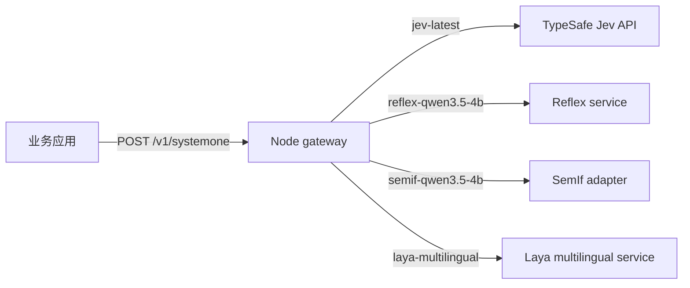

# Architecture

## 范围

本仓库只解决一个问题：用稳定的 Jev `/v1/systemone` 请求形状切换托管与本地决策模型。它是可复用 infra，不决定上层项目是聊天、审核、推荐还是 Agent。

## 边界

- `packages/contracts`：TypeBox 请求/响应契约，以官方 Jev OpenAPI 可接受形状为基线。
- `packages/core`：模型 ID 到 provider 的精确路由；没有静默 fallback。
- `packages/provider-jev`：统一的超时、HTTP 错误和响应校验；同时供 Jev、Reflex、SemIf、Laya HTTP 端点复用。
- `services/laya`：固定官方 Python runtime 和 multilingual 权重 revision，通过薄 HTTP sidecar 暴露原生 System One 语义。
- `apps/gateway`：唯一公开入口；只做校验和路由。
- `services/semif`：把 Jev `choice` 显式映射为 SemIf 原生 rows，再重建回答。
- `services/reflex`：只固定并启动上游已有服务，不维护第二份实现。
- `models/registry.json`：模型来源、许可证与 revision 的单一清单。

## 关键约束

1. 请求指定未知模型时返回错误，不降级到另一模型。
2. 网络 provider 不自动重试，避免一次决策被隐式执行多次。
3. Laya、SemIf 在 CLI 启动时显式加载；单纯 import 不下载权重，权重也不进入 Git 或镜像。
4. 当前 SemIf 只实现有原生语义支撑的 `choice`。不支持的能力显式失败。
5. Docker 是部署适配层；宿主机运行与容器运行使用同一 HTTP 契约。

## 扩展方式

新增模型时，先给它一个稳定且不冒充其他权重的模型 ID，再实现 `DecisionProvider` 或提供 `/v1/systemone` HTTP 服务，最后加入 registry 和配置。若新模型不能表达完整 Jev 语义，应像 SemIf 一样公开能力边界，而不是在 provider 间自动改写或 fallback。
